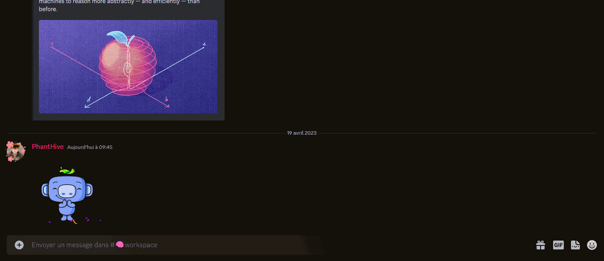

<h1 align="center"> 
   
    </img>
   
    A-Nia 
   
</h1>

<h2 align="center"> 
  Private Bot | Large archive | Help for students | Powerful Welcome msg and Music Bot 
</h2>

  
  
  
  

## Overview:
A-Nia (stand for: A=Awesome and Nia (from Swahili language)=Brillant) 
- A-Nia **cannot be installed**, it's a private bot used by IPSA students.
- A-Nia **before 2024**, this bot will not be deleted, given, or made public.
- A-Nia **is** a property of **Phearion* and **IRIS Robotics**

### Options

> Command
* music (with all due commands)
> Archive
* revision cheat sheet
* exercice
* and more+
